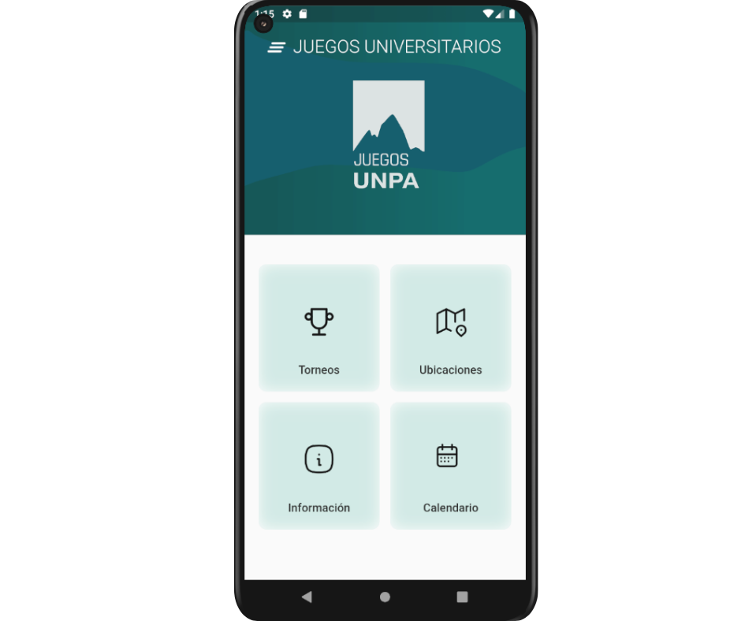

# Juegos UNPA

## Descripción

**Juegos UNPA** es una aplicación móvil desarrollada para la gestión de los juegos universitarios de la Universidad Nacional de la Patagonia Austral. Esta aplicación está diseñada para facilitar la organización y administración de los encuentros deportivos, así como para generar y mantener actualizadas las tablas de posiciones de los equipos participantes.

## Funcionalidades Principales

- **Gestión de Encuentros Deportivos:** Permite programar y administrar los partidos y competiciones entre los diferentes equipos universitarios.
- **Generación de Tablas de Posiciones:** Automáticamente calcula y actualiza las tablas de posiciones basadas en los resultados de los encuentros, ofreciendo una vista clara y precisa del rendimiento de cada equipo.
- **Notificaciones y Alertas:** Informa a los usuarios sobre los horarios de los partidos, cambios en la programación y actualizaciones en las posiciones.
- **Interfaz Amigable:** Diseñada para ser intuitiva y fácil de usar, facilitando la navegación y el acceso a la información relevante para estudiantes, deportistas y organizadores.

## Objetivos

- Simplificar la logística y administración de los eventos deportivos universitarios.
- Proveer una herramienta accesible para que los estudiantes y equipos sigan de cerca el desarrollo de los juegos.
- Mejorar la transparencia y precisión en la generación de las tablas de posiciones.

## Beneficiarios

- Estudiantes de la Universidad Nacional de la Patagonia Austral.
- Equipos deportivos universitarios.
- Organizadores de los juegos universitarios.

---